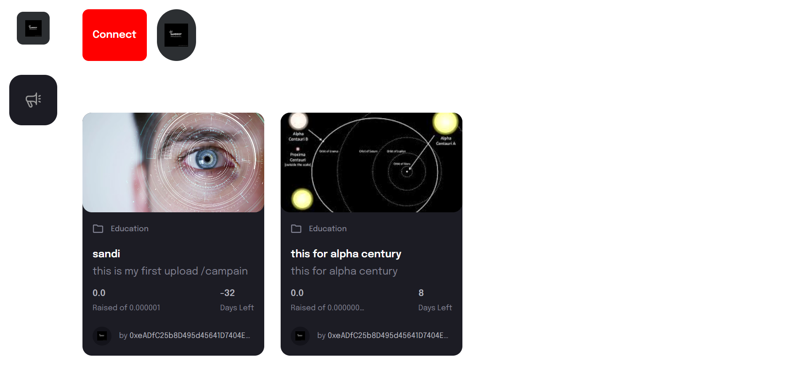

#command for starting

```bash
npx thirdweb create --contract
```

```bash
cd web3
npm i dotenv
npm install --save-dev hardhat
```

```bash
 cd ..
 cd client
npm install wagmi ethers@^5
```

```bash
npm run deploy
npm run dev
```

# Build and Deploy a Web3 funding Platform As Blockchain Application


